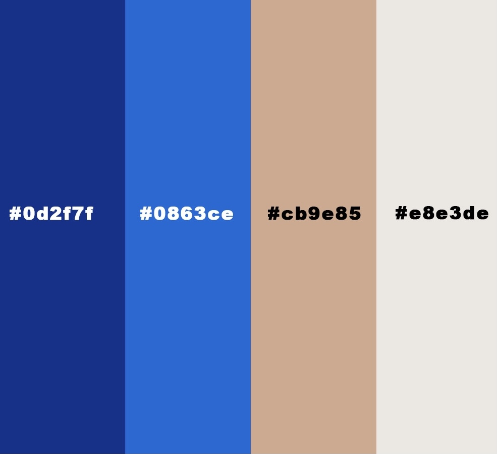
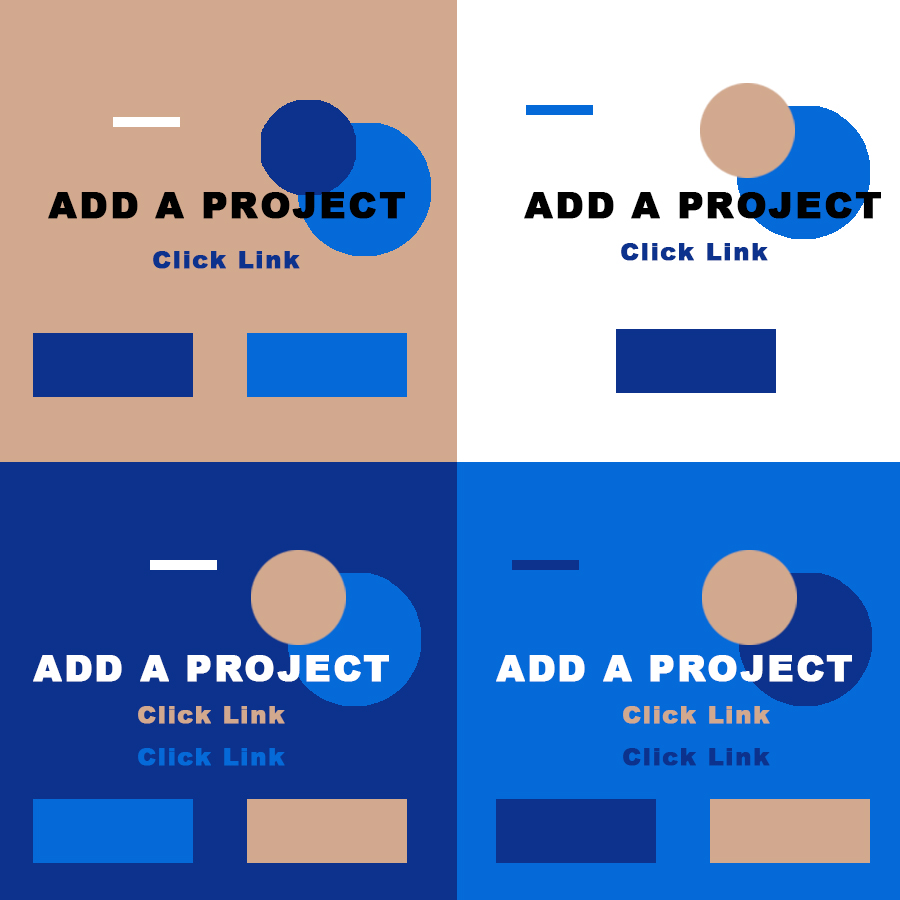
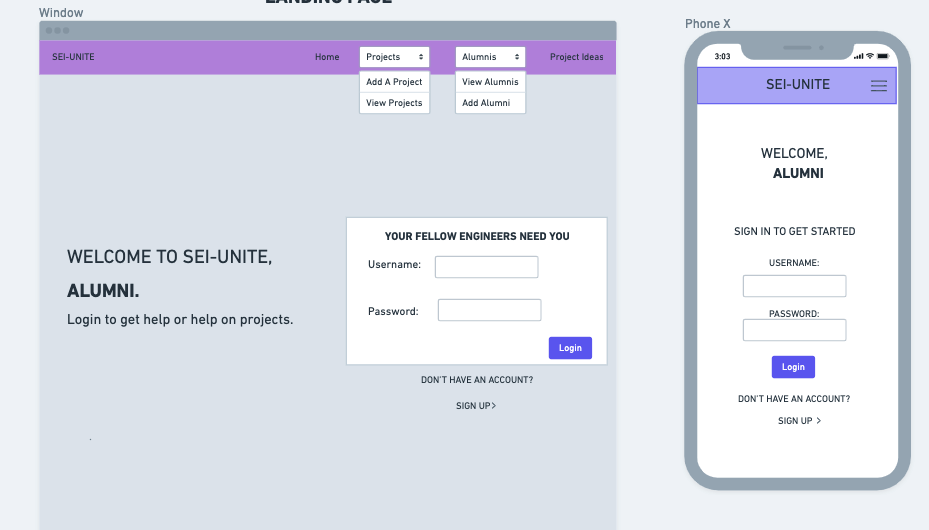
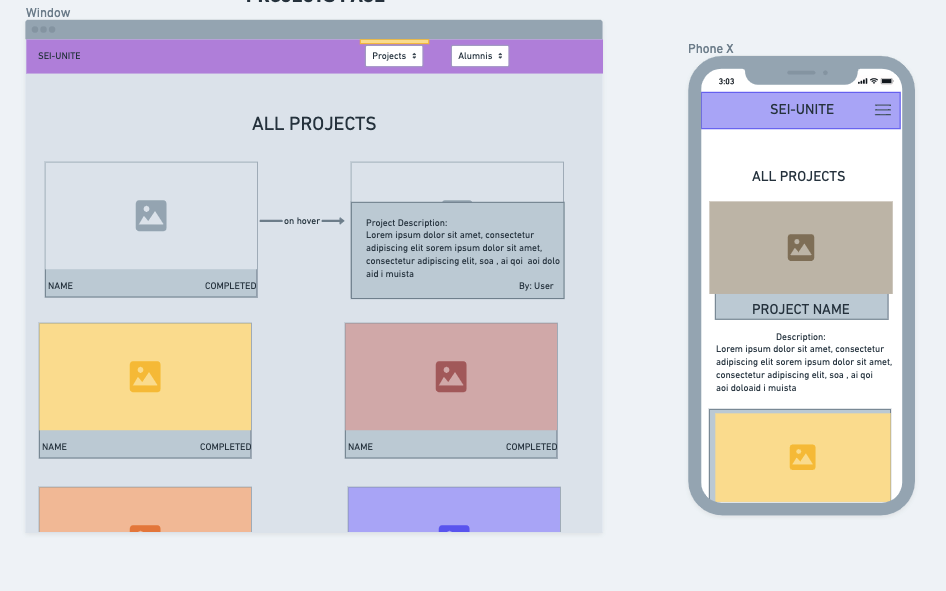
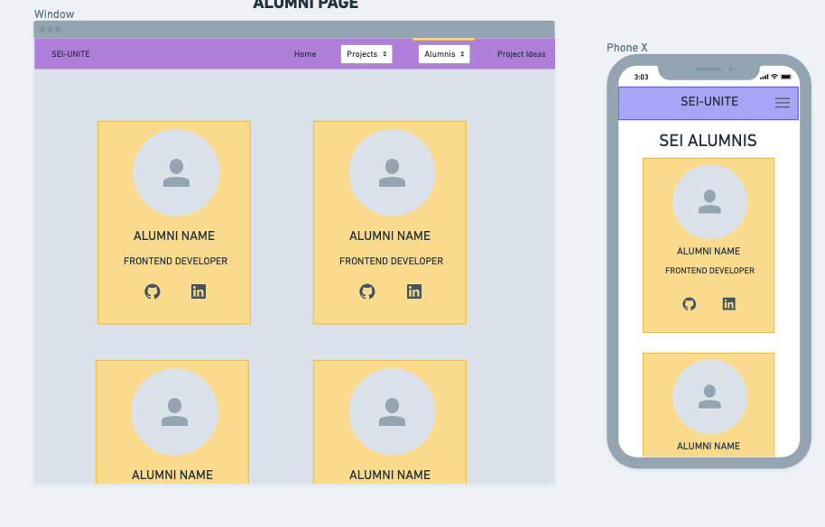
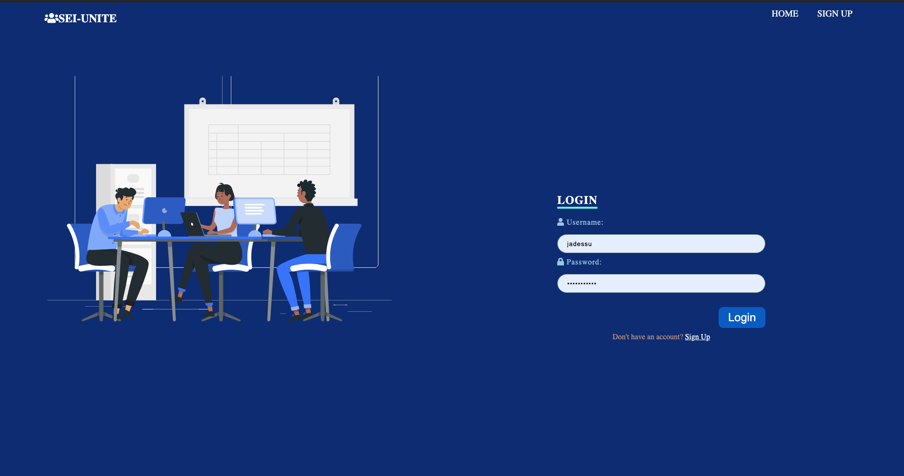
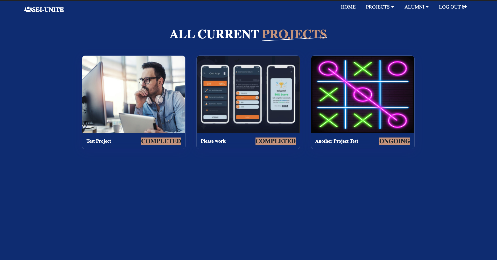
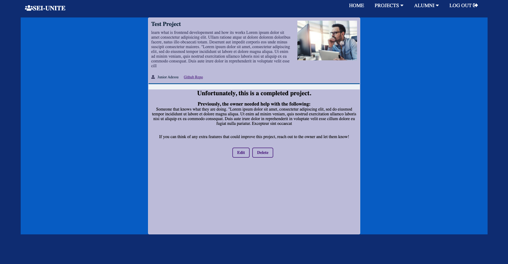
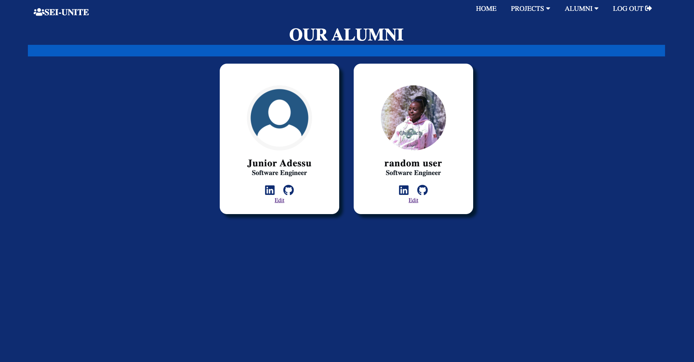

# SEI Unite
## A Full-stack Django App

[SEI Unite WEBSITE](https://sei-unite.herokuapp.com/)

SEI Unite is a full-stack django where users can add projects they are working on and other users can reach out and collaborate as a group . 

- Note: This app was created with software engineering users in mind.

## Features

- Users can sign up and log in on the app.
- Users can add projects, the projects github repo, a banner image, the completion status, and what they need help with.
- Users can view other projects and reach out to the owner
- Completion Status of the project can be updated and the project can be deleted.
- User can add themselves as an alumnus of SEI and view other users that have added themselves.

## Tech

### Languages & Frameworks

- [HTML] -The standard markup language for documents designed to be displayed in a web browser. 
- [CSS] - A style sheet language used for presentation of a wesbite.
- [JAVSCRIPT] - Prototype based object oriented language.
- [FLEXBOX] -  A layout model that allows elements to align and distribute space within a container. 
- [GRID] - Enables an author to align elements into columns and rows.
- [PYTHON]- The main programming language of the app.
- [DJANGO] - Python-based framework that uses the model-template-views pattern

### Websites
- [ICONS8](https://icons8.com/) - Download design elements for free: icons, photos, vector illustrations, and music for your videos.
- [uiGradients](https://uigradients.com/#Venice) - A handpicked collection of beautiful color gradients for designers and developers​.
- [fontawesome](https://fontawesome.com) - A font and icon toolkit based on CSS and less.

### Resources Info
- [Newrelic](https://newrelic.com/blog/nerd-life/developer-resources-roundup) - List of developers resources
- [Hackernoon](https://hackernoon.com/top-resources-for-software-engineers-how-a-new-grad-can-find-a-job-fvhr3yjz) - Top resources for developers.
- [HackReactor](https://www.hackreactor.com/blog/7-books-software-engineers-need-to-read-to-get-ahead) - List of top Software Engineering books.
- [Onlinecoursereport](https://www.onlinecoursereport.com/free/software-development/) - Statistics on top free online courses for developers
-[Freecodecamp](https://www.freecodecamp.org/news/the-10-most-popular-coding-challenge-websites-of-2016-fb8a5672d22f/) - List of coding challenge websites.

### Sites used for help.
-[CSS-Tricks](https://css-tricks.com/position-sticky-and-table-headers/) - Guide on fixed table headers.

 

-[StackOverflow]- Guide on scrollable table with fixed headers. Code used in templates/about.html and templates/idea.html

### Colors.
- [Coolors](https://www.coolors.co/) - Color Research. 
 

### Theme and Palette

   
 

# PSEUDOCODE

1.
 ## Home-Page  
Upon loading the page, the user will be presented with the homepage, which includes the _title_, _navigation-bar_, and _logo_
    
>The user can navigate to the signup page on the navbar or under the login form. The content of the home page will changed depending on whether there is a user logged in or not.
2. 
## Projects  
On the projects page, the user will have access to 3 links. These links include _view projects_, _my projects_, and _add project_.

- View projects includes all the projects that has been added to the page.

- My projects filters all the projects and only displays the one that has been added by the current user.
- Add project will display a form for the user to add in a new project. 

3.

 ## Alumni  
The Alumni section includes 2 links, _View Alumni_ and _Add Alumnus_

- View Alumni include all the alumnus that has been added to the page. Each alumnus is associated with a user.
- Add alumnus will present the user with a form where they can add themselves as an alumnus on the alumnia page.
    

 # WIREFRAME
### Landing Page

### Projects Page

### Alumni Page

# SPECIAL THANKS
- First and foremost, to all my instrcutors and peers from GA SEIR-EC-6-7 and to all my fellow engineers..

- The Engineering Channel - All of my problems that couldn't be resolved with stackoverflow were easily resolved throught the engineering channel.

- [ljc-dev](https://dev.to/ljcdev/easy-hamburger-menu-with-js-2do0) - For my mobile responsivess, I wanted to incoorporate a hamburger menu that I see on every site. He had a guide on how to do that on the dev website. 

- [Stackoflow](www.stackoverflow.com) - Links for each function from stack overflow that was tweaked will be included in the comments at the end of the JS file.

## APP SCREENSHOTS
 
 

## FUTURE UPDATES

- [ ] Add and update users on projects to other users can see the group that is currently working on that project.
- [ ] Make your own quiz(enter your own questons and answers) and be tested on it!
- [ ] Limit access to certain users and add admin privileges 
- [ ] Include a retrive forgotten password functionality.
- [ ] Show all projects repo on alumnus' detail page.
- [ ] Add a functionality where users can comment on other projects.
- [ ] Implement github api to load user's repo.

 
 
 
 
 
 
 
 
 
            